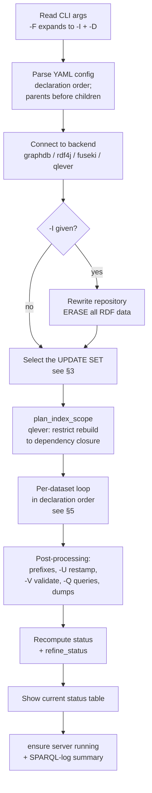
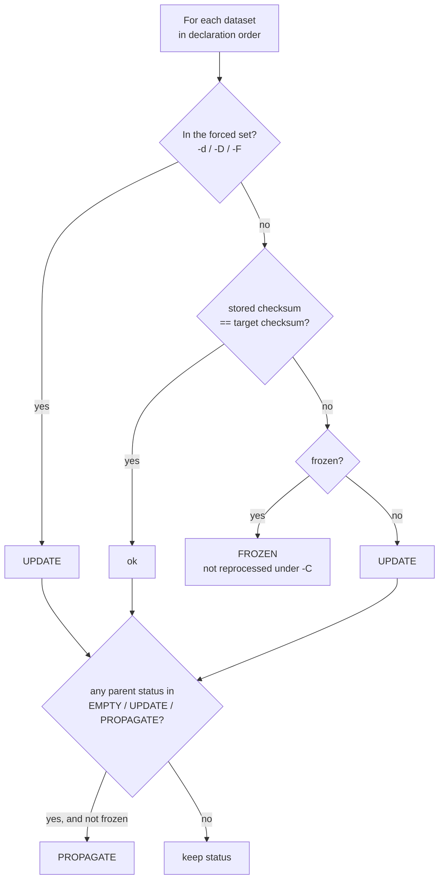
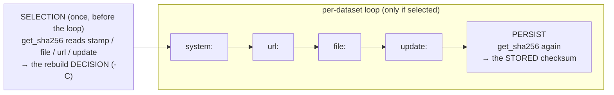
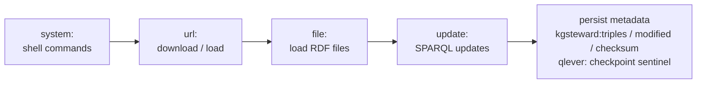

# Execution model — processing order & update triggers

This page explains, for a single `kgsteward` run:

1. **In what order** things happen — the phases of a run, how the *update set*
   is selected, and the order in which a dataset's own statements are executed.
2. **What triggers a dataset to be (re)processed** — the per-dataset checksum,
   the status it produces, and how changes propagate to dependent datasets.

The logic lives in two files: configuration parsing in
[`yamlconfig.py`](../src/kgsteward/yamlconfig.py) and the workflow in
[`kgsteward.py`](../src/kgsteward/kgsteward.py) (`main()`).

---

## 1. Datasets are processed in declaration order

`kgsteward` does **not** topologically sort datasets at run time. It processes
them in the **order they appear in the YAML `dataset:` list**, and relies on a
parse-time rule to make that order valid:

> A `parent:` must refer to a dataset **declared earlier** in the file
> (`parse_yaml_conf` raises *"Parent not previously defined"* otherwise;
> `parent: "*"` means "all datasets declared so far").

Because every parent precedes its children, **declaration order is already a
valid dependency order**. This is what lets status propagation (below) work in a
single forward pass: by the time a child is evaluated, all its parents' statuses
are final.

Each dataset is initialised by the parser with `status = "EMPTY"` and empty
`count` / `date` / `sha256`, later filled from the store.

---

## 2. The phases of a run

The **update set** (`rdf_graph_to_update`) computed in phase F is the single
decision that governs which datasets the loop in phase H actually touches;
everything else is skipped with an *up-to-date* note.

---

## 3. Selecting the update set (the CLI triggers)

Which datasets enter the update set depends on the mutually-exclusive flags,
checked in this priority:

| Flag | Update set | Status checked? |
|------|-----------|-----------------|
| `-D` (or `-F` = `-I -D`) | **all** datasets | no — force all |
| `-d name1,name2` | the **named** datasets | no — forced |
| `-C` | datasets whose **status ∈ {EMPTY, UPDATE, PROPAGATE}** | **yes** — see §4 |
| *(none of the above)* | **empty** → nothing is processed; the run only reports status | — |

Other relevant flags:

- `-I` — (re)create / wipe the repository's RDF data *before* the loop. Combine
  with `-C`/`-D` to repopulate.
- `-U` — re-stamp the stored checksum/metadata **without** reloading data (marks
  a dataset current; use after an out-of-band change you trust).
- `--force_unfreeze` — clear all `frozen` flags for this run.

Under `-C`, a backend may resolve the set **offline**: qlever, when its server is
stopped, compares each dataset's target checksum to the checksum stored in its
checkpoint sidecar (`update_set_offline`). Otherwise the set comes from the
**online** status query (`update_config`). Both use the same trigger semantics.

---

## 4. What triggers an update — the per-dataset checksum

For each dataset, `get_sha256()` computes a SHA-256 over the dataset's
**inputs**. A dataset is considered changed when this freshly-computed *target*
checksum differs from the checksum **stored in the triplestore** from the last
successful load (`kgsteward:checksum`).

**What goes into the checksum** (in this order):

| Input | What is hashed |
|-------|----------------|
| `context` | the target graph IRI |
| `parent` | the parent dataset **names** (see caveat below) |
| `system` | each shell command string |
| `file` | the **byte content** of every matched local file |
| `url` | each URL string **+ its HTTP `HEAD` info** (Last-Modified / ETag) |
| `stamp` | each path **+ HEAD info** (remote) or **byte content** (local) |
| `replace` | every key/value substitution pair |
| `update` | the **text** of every SPARQL update file |
| `zenodo` / `special` | record checksums / special keys |

**What is deliberately *not* hashed:**

- **Parent *content*** — only parent *names* are hashed, not their checksums.
  So a parent's data changing does **not** change a child's checksum; the child
  is instead rebuilt through *status propagation* (§4.2). *(This is a known
  simplification; a redesign to fold parent lineage into the checksum is
  deferred.)*
- **`frozen`** status — it is not a property of how the content is generated.

So, in practice, a dataset's update is triggered by any of: **edited input
file**, **changed remote resource** (new Last-Modified/ETag), **edited SPARQL
update file**, or a changed **`system` / `url` / `replace` / `stamp` / `context`**
entry.

### 4.1 The status decision

States: **EMPTY** (no data in store) · **ok** (current) · **UPDATE** (inputs
changed, or forced) · **FROZEN** (changed but frozen → left alone) · **PROPAGATE**
(unchanged itself, but a parent is being rebuilt).

Under `-C`, every dataset ending in **EMPTY / UPDATE / PROPAGATE** is
(re)processed.

### 4.2 Propagation cascades down declaration order

Because `update_config` evaluates datasets in declaration order and parents
always precede children, a parent marked `UPDATE` flips each not-frozen child to
`PROPAGATE` in the same pass — and a `PROPAGATE` child in turn propagates to *its*
children. A `frozen` dataset stops the cascade (it is never auto-marked) and must
be refreshed explicitly with `-d <name>` or `--force_unfreeze`.

### 4.3 *When* the checksum is computed — relative to `system:`

`get_sha256()` reads `stamp` / `file` / `url` / `update` **at the moment it is
called**, and it is called at **two different points** in a run, with the
`system:` clause running **between** them:

1. **At selection** (phase F, *before* the per-dataset loop) — under `-C`, to
   decide which datasets are out of date. This read sees inputs **as they are
   before any `system:` command of the current run**. (`-d` / `-D` skip this and
   force the set, so no selection-time checksum is taken.)
2. **At persist** (`update_dataset_info`, at the end of each processed dataset,
   *after* that dataset's `system` → `url` → `file` → `update`) — to compute the
   `kgsteward:checksum` **stored** in the store for next time. This read sees
   inputs **after** `system:` ran.

**Consequences:**

- A dataset's `system:` step runs **after** the checksum that decided whether to
  rebuild it — so `system:` **cannot trigger its own dataset's rebuild within
  the same run**. Its effect on the inputs is captured only by the *persisted*
  checksum, i.e. it is detected by the **next** run's selection.
- Therefore point **`stamp` (and `url` / `file`) at the *upstream source*** whose
  change should trigger a rebuild — **not** at a file your own `system:`
  produces. A `stamp` on a `system:` output won't have been regenerated yet at
  selection time, so it can't drive the decision; a `stamp` on the upstream
  input (e.g. a remote URL whose `Last-Modified` changes) is what makes a
  `system:`-generated dataset rebuild when its source changes.

---

## 5. Order of statements *within* a dataset

When a dataset is processed, its own clauses run in this fixed order (a single
iteration of the loop in `main()`):

- **`system`** runs first — typically to *produce* the files/data the later
  clauses consume (e.g. a `curl … > file` or a generator script).
- **`url`** then **`file`** load the dataset's base RDF.
- **`update`** applies SPARQL `INSERT`/`DELETE`/`LOAD` statements. **Order
  matters and is preserved**: files are processed in list order, and each file
  is split into individual statements applied in document order, after
  `replace:` string substitution (`${TARGET_GRAPH_CONTEXT}` etc.).
- **persist** records the dataset's metadata (triple count, modified time, and
  the new `kgsteward:checksum` = the target checksum just computed). For live
  backends this writes the metadata triples; for qlever it enqueues the
  checkpoint dump (see the qlever driver docs).

A dataset may use any subset of these clauses (import-only, updates-only, both,
or none); the order above is simply skipped where a clause is absent.

---

## 6. Quick reference — "why did (or didn't) this dataset rebuild?"

| Situation | Result under `-C` |
|-----------|-------------------|
| Input file edited / remote resource changed | checksum differs → **UPDATE** |
| SPARQL `update:` file edited | checksum differs → **UPDATE** |
| A parent dataset is being rebuilt | child → **PROPAGATE** (unless frozen) |
| Nothing changed | **ok** → skipped |
| Changed but `frozen: true` | **FROZEN** → skipped (use `-d` / `--force_unfreeze`) |
| Parent *content* changed but child inputs unchanged, and parent **not** in the set | child stays **ok** — parent content is not in the child checksum; rebuild the parent (→ child PROPAGATE) or use `-d` |
| `-d name` given | **UPDATE** regardless of checksum |
| `-D` / `-F` | **all** rebuilt |

---

*Cross-references:* configuration keys are documented in
[`doc/yaml`](yaml/kgsteward.schema.md); backend-specific behaviour (notably
qlever's deferred checkpoint/rebuild model) is in
[`doc/drivers`](drivers/README.md).
