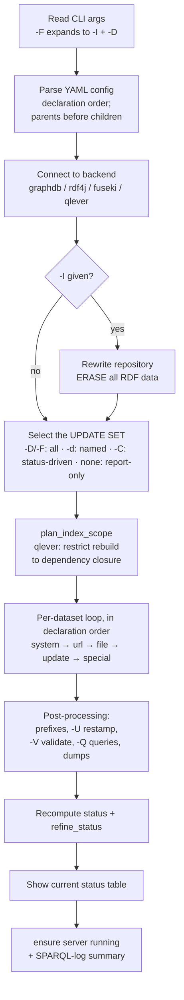
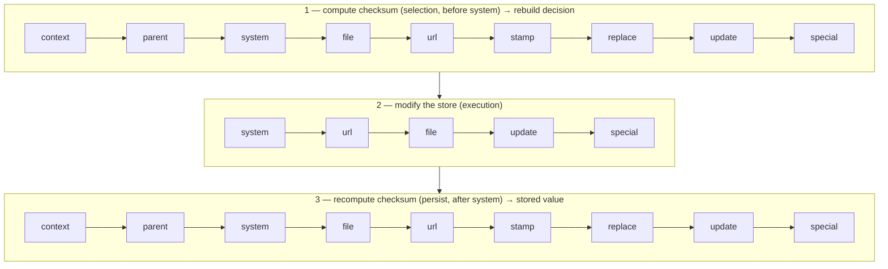

# Execution model — processing order & update triggers

For a single `kgsteward` run: the order things happen in, and what makes a
dataset be (re)processed. Logic lives in
[`yamlconfig.py`](../src/kgsteward/yamlconfig.py) (parsing) and
[`kgsteward.py`](../src/kgsteward/kgsteward.py) (`main()`).

## Lifecycle

Datasets are processed in **declaration order**. There is no run-time
topological sort; instead a parse-time rule guarantees that order is valid: a
`parent:` must be declared *earlier* in the file (`parent: "*"` = all datasets so
far). So every parent precedes its children, which is what lets status
propagation work in one forward pass.

Within a selected dataset the clauses always run in this single fixed order:

> **`system` → `url` → `file` → `update` → `special`**, then the dataset's metadata is persisted.

`system` typically *produces* the data the later clauses load; `update` SPARQL
statements run in file order then document order; `special` emits
kgsteward-generated triples (void / prefix / query descriptions). `replace` is
**not** a stage — it is the string-substitution map applied to the `update` text
before it runs. Any clause may be absent. This order is **not configurable**: to
run steps in any other order (e.g. an `update` before a `file` load), split the
work across **two datasets** and declare the second with the first as its
`parent:` — the dependency forces the first to be processed in full before the
second.

## What triggers a rebuild

A dataset's *target checksum* (`get_sha256`) is compared to the checksum stored
from its last load (`kgsteward:checksum`). The checksum covers the dataset's
**inputs**:

| Hashed | Not hashed |
|--------|------------|
| `context` IRI; `system` command strings; `file` **byte content**; `url` string **+ HTTP HEAD** (Last-Modified/ETag); `stamp` (HEAD or content); `replace` pairs; `update` file **text**; `special` keys | parent **content** (only parent *names* are hashed — see below); `frozen` status |

So a rebuild is triggered by an edited input file, a changed remote resource, an
edited `update`/`system`/`replace`/`url`/`stamp` entry, or a forcing flag.

Each dataset resolves to one status: **forced** (`-d`/`-D`/`-F`) → `UPDATE`;
else **checksum matches** → `ok`; else **frozen** → `FROZEN` (skipped); else
→ `UPDATE`. Finally, a not-frozen dataset with a parent that is `EMPTY`/`UPDATE`/
`PROPAGATE` becomes `PROPAGATE`.

Under `-C`, every dataset ending **EMPTY / UPDATE / PROPAGATE** is reprocessed.
Because datasets are evaluated in declaration order, a parent marked `UPDATE`
flips its not-frozen children to `PROPAGATE` in the same pass, cascading
downward; a `frozen` dataset never auto-marks and stops the cascade (refresh it
with `-d` or `--force_unfreeze`).

> **Parent content is not in the child checksum** — only parent *names* are.
> A parent's data changing rebuilds the child through `PROPAGATE` (when the
> parent is in the update set), not through the checksum.

## The three passes over a dataset

A dataset definition is traversed **three times** per run, each time over a
different subset of clauses. The store is modified only in the middle pass;
`stamp` (and `context`, `parent`, `replace`) feed the checksum passes only.

Pass 1 runs only under `-C` (`-d`/`-D` force the set and skip it). In passes 1
and 3 each clause is *hashed* (e.g. `system` = its command text); in pass 2 the
clauses are *executed* (e.g. `system` = the command runs). Because the store is
modified (pass 2) **after** the deciding checksum (pass 1), a dataset's `system:`
cannot trigger its own rebuild in the same run — its effect is captured by
pass 3 and seen only by the next run. So point `stamp`/`url`/`file` at the
**upstream source** whose change should trigger a rebuild, never at a file your
own `system:` produces.

## Reference

| Situation (under `-C`) | Result |
|------------------------|--------|
| input file / remote resource / `update` text changed | **UPDATE** |
| a parent is being rebuilt | child **PROPAGATE** (unless frozen) |
| nothing changed | **ok** — skipped |
| changed but `frozen: true` | **FROZEN** — skipped (use `-d` / `--force_unfreeze`) |
| parent *content* changed, child inputs unchanged, parent **not** in set | child stays **ok** — rebuild the parent, or use `-d` |
| `-d name` / `-D` / `-F` | forced **UPDATE** / all |
