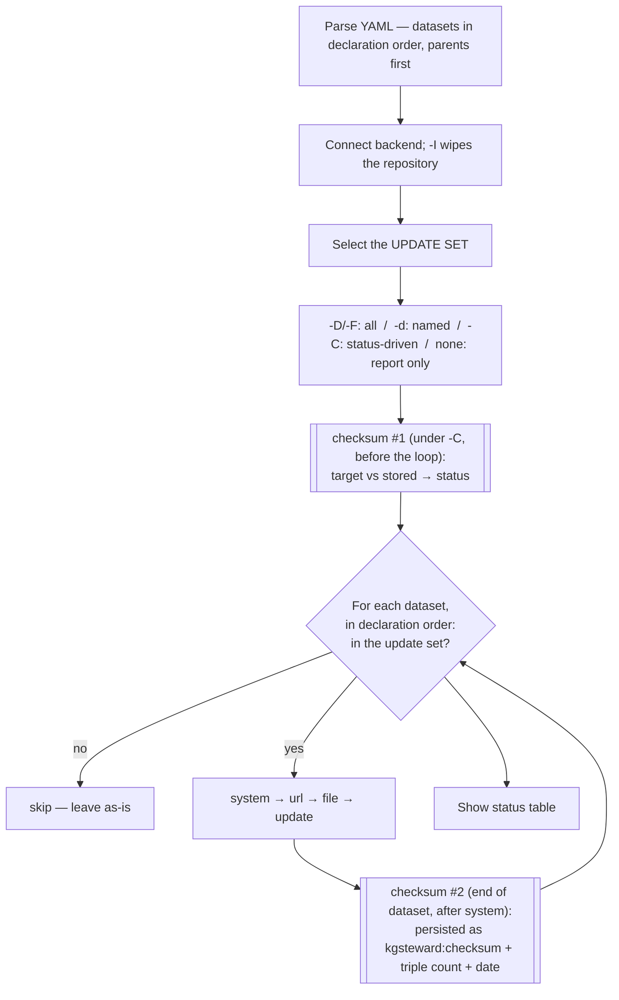
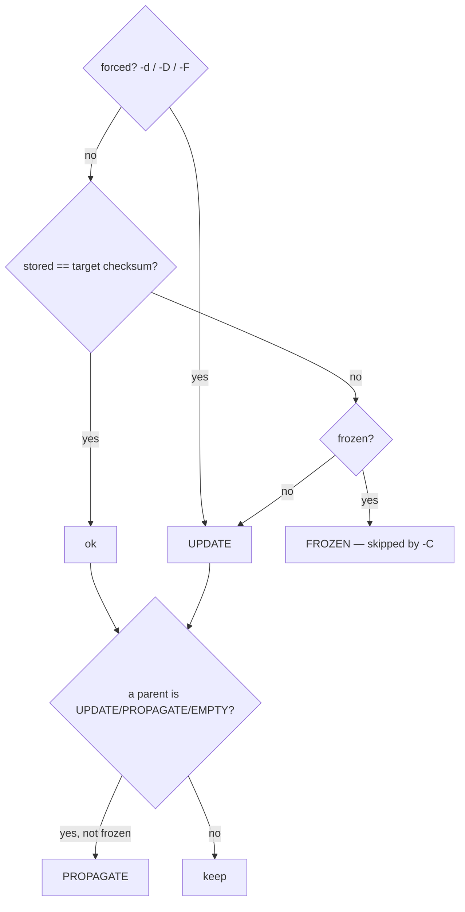

# Execution model — processing order & update triggers

For a single `kgsteward` run: the order things happen in, and what makes a
dataset be (re)processed. Logic lives in
[`yamlconfig.py`](../src/kgsteward/yamlconfig.py) (parsing) and
[`kgsteward.py`](../src/kgsteward/kgsteward.py) (`main()`).

## Lifecycle

Datasets are processed in **declaration order**. There is no run-time
topological sort; instead a parse-time rule guarantees that order is valid: a
`parent:` must be declared *earlier* in the file (`parent: "*"` = all datasets so
far). So every parent precedes its children, which is what lets status
propagation work in one forward pass.

Within a selected dataset the clauses always run in the order
**`system` → `url` → `file` → `update`**: `system` typically *produces* the data
the later clauses load; `update` SPARQL statements are applied in file order then
document order, after `replace:` substitution. Any clause may be absent.

## What triggers a rebuild

A dataset's *target checksum* (`get_sha256`) is compared to the checksum stored
from its last load (`kgsteward:checksum`). The checksum covers the dataset's
**inputs**:

| Hashed | Not hashed |
|--------|------------|
| `context` IRI; `system` command strings; `file` **byte content**; `url` string **+ HTTP HEAD** (Last-Modified/ETag); `stamp` (HEAD or content); `replace` pairs; `update` file **text** | parent **content** (only parent *names* are hashed — see below); `frozen` status |

So a rebuild is triggered by an edited input file, a changed remote resource, an
edited `update`/`system`/`replace`/`url`/`stamp` entry, or a forcing flag.

Under `-C`, every dataset ending **EMPTY / UPDATE / PROPAGATE** is reprocessed.
Because datasets are evaluated in declaration order, a parent marked `UPDATE`
flips its not-frozen children to `PROPAGATE` in the same pass, cascading
downward; a `frozen` dataset never auto-marks and stops the cascade (refresh it
with `-d` or `--force_unfreeze`).

> **Parent content is not in the child checksum** — only parent *names* are.
> A parent's data changing rebuilds the child through `PROPAGATE` (when the
> parent is in the update set), not through the checksum.

## When the checksum is computed — relative to `system:`

`get_sha256` reads `stamp`/`file`/`url`/`update` *when it runs*, and (see the
lifecycle diagram) it runs **twice**, with `system:` between:

- **checksum #1**, at selection, *before* the loop — the rebuild **decision**
  (`-C` only; `-d`/`-D` force the set and skip it). Sees inputs **before** this
  run's `system:`.
- **checksum #2**, at persist, *after* the dataset's `system`/`url`/`file`/`update`
  — the value **stored** for next time. Sees inputs **after** `system:`.

Consequence: a dataset's `system:` runs after the deciding checksum, so it
**cannot trigger its own rebuild in the same run** — its effect is only seen by
the *next* run. Point `stamp`/`url`/`file` at the **upstream source** whose change
should trigger a rebuild, never at a file your own `system:` produces.

## Reference

| Situation (under `-C`) | Result |
|------------------------|--------|
| input file / remote resource / `update` text changed | **UPDATE** |
| a parent is being rebuilt | child **PROPAGATE** (unless frozen) |
| nothing changed | **ok** — skipped |
| changed but `frozen: true` | **FROZEN** — skipped (use `-d` / `--force_unfreeze`) |
| parent *content* changed, child inputs unchanged, parent **not** in set | child stays **ok** — rebuild the parent, or use `-d` |
| `-d name` / `-D` / `-F` | forced **UPDATE** / all |
